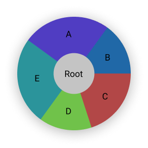

作用域是一种集合，它本身也携带信息，根据它携带信息的不同，它们会表现出差异化的性质。

#### 单位作用域

指一般的、标准的作用域

#### 包作用域

所有拓展包的作用域都从包作用域开始。

包是工程化中的最小单位。

在包作用域中允许拓展所在域。

#### 类型定义作用域

```
type People {
	name str
	
	rename( str ) {
		name = $0
	}
	run() { ... }
}
```

#### 函数作用域


关于隐式变量，参见`Lang/函数/隐式变量.md`。


#### 结构作用域

结构作用域是带有

```
struct {
	@ {
		str a
		str b
	}
	{
		input text = a + b
	}
}
```


#### 根作用域



根作用域是系统运行期间所有非根作用域的最远子集。即所有的超集都从根作用域诞生。

根作用域是相对的。